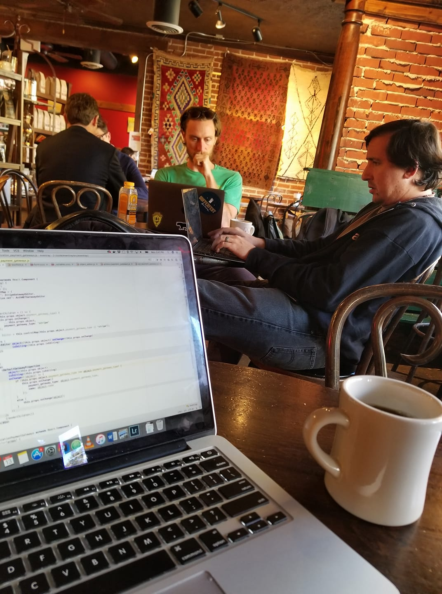
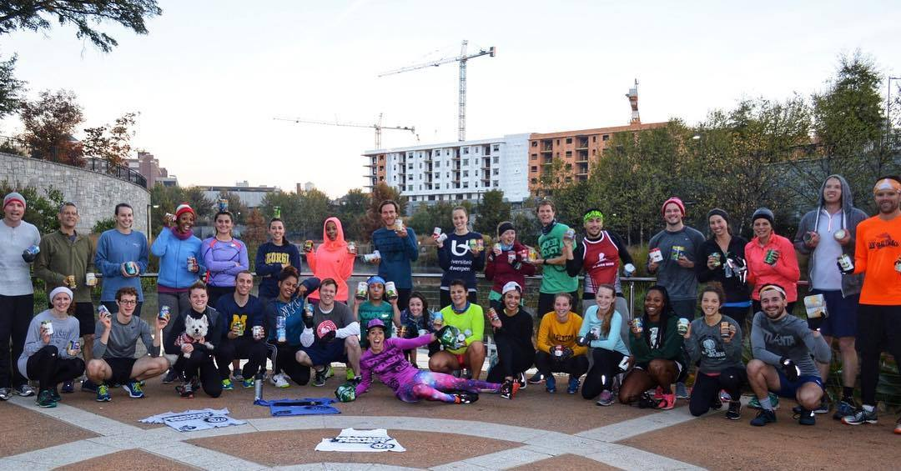
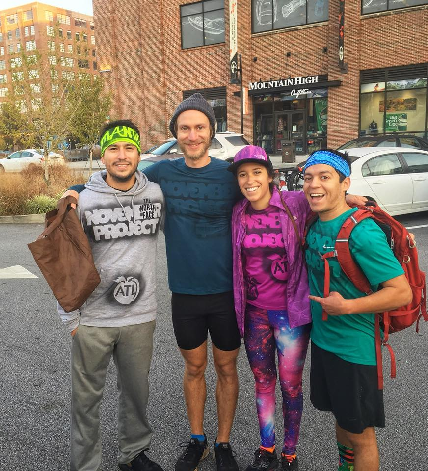

The whole EventRay team, all three of us, got together in Atlanta this past week for a coding "sprint." It was pretty successful on all fronts: We accomplished five weeks of work, ate real bar-b-que1, chicken and waffles, and saw Marietta's giant animatronic chicken.

 _It's trying to eat me!_
 _Working from Cafe San Francisco (in Atlanta)_

We stayed at a place near Chattahoochee River National Park, so I got to check another national park off my list. Went running on the trails there one morning and saw a giant buck.

It dawned on me that Atlanta has a November Project tribe, and that I could make their Wednesday morning workout before my flight home so I booked a hotel near Ponce City Market, where the workout would be held. I set my alarm before going to bed, then I woke up and saw 6:22 on my clock, eight minutes before the start! I never sleep through my alarm. I leapt out of bed, got dressed, ran outside and started booking it. Now, it was a special workout in that everyone was encouraged to bring a few cans of food for a local charity. So there I was, running pell-mell in the early morning twilight, carrying my four cans of Green Giant. I get to the meeting spot expecting to see a big crowd. No one. A minute later I see a couple guys running, so I hazard to guess they're also looking for the workout. Turns out they are, and they're somewhat familiar with the area, so after a bit of wandering around we come to a park and see some people running with cans. Success!

The workout was designed to incorporate the cans: running with one can in each hand, doing lunges while shoulder pressing the cans, you get it... During the workout I got my shirt "tagged"2 with the Atlanta tribe's decal: ATL inscribed in a peach, then afterwards got some coffee with the friendly leaders of the Atlanta tribe and another visitor from Austin, Texas. Then I booked it back to the hotel to get ready for my flight.

 _The workout crew_
 _Myself, two of the leaders and the visitor from Austin_

****

<small>footnotes</small>

##

1. <small>
First place we went to was a korean/southern bar-b-que fusion joint. We later decided that didn't really count and went to a place called D.B.A. in Virginia Highlands.
</small>
2. <small>
Spray-painted. It's like a wearable passport book!
</small>
