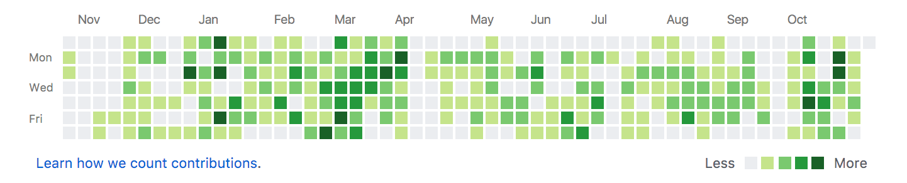

If I seem flakey or unresponsive in the recent past or in the next couple months, it's because we ([EventRay](http://eventray.com)) have an important deadline to meet. There are two big events we _need_ to land as clients. There's a lot of work we need to do on our product to meet the needs of those clients. Enough to keep us very busy every day, including weekends, until the first event launches in early January. So probably less exercise, socializing, days off for me until that work is done.

Sidebar: My Github contribution history
 Darker green means more work done. There's about to be much darker green squares on the right side.

Whenever I have to do long bouts of programming work I tend to feel like a zombie when away from the computer. Perhaps that’s because those areas of the brain that I use when programming get all the exercise and the rest kinda goes to sleep, then when I’m doing other things like talking to human beings it takes a bit for them to wake up.

It's funny how deadlines work. They’re always stressful. A little stress inspires, but _too_ much and I find myself getting anxious. Anxiety leads to more mistakes and myopic choices which make meeting the deadline harder. This is one of the latter sort of deadline, but I also know that being anxious is a choice, even if it's hard to resist sometimes. So I’m fighting a battle on two fronts. One, completing the work itself. Two, resisting the thoughts about the work that create anxiety.

All that is to say, to those who know me, I may need your understanding and patience for a time (or more than usual.) In exchange I’ll be the best friend, family member and human being I know how to be.

