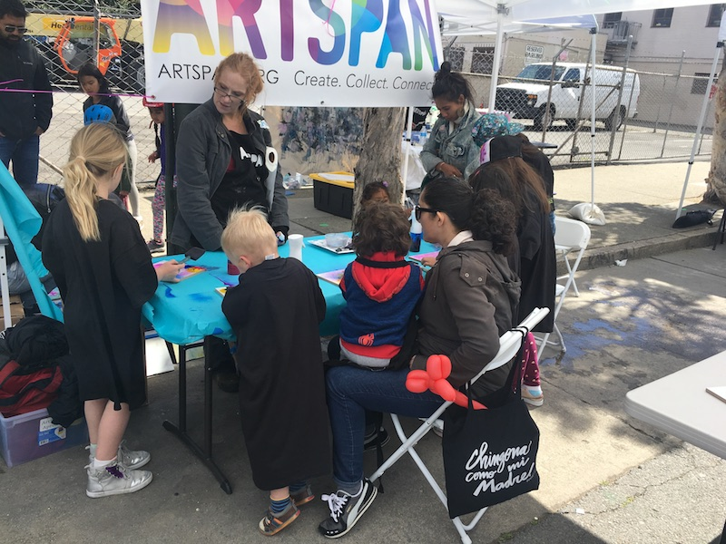
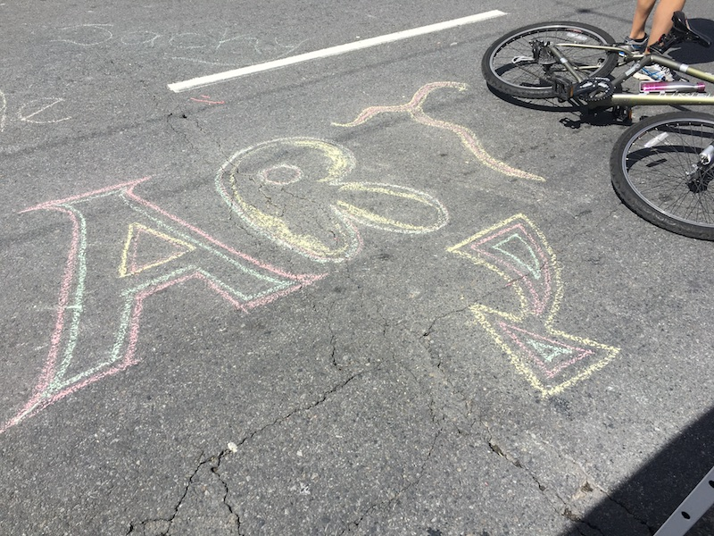
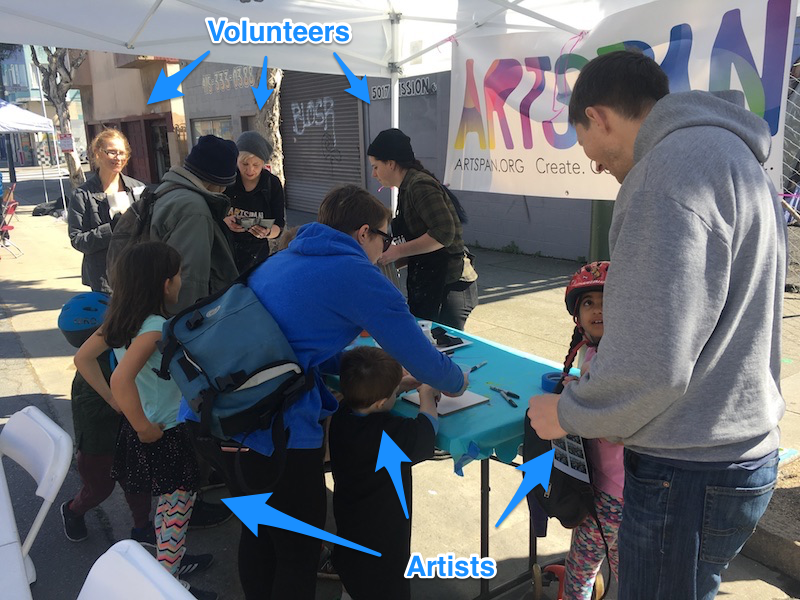
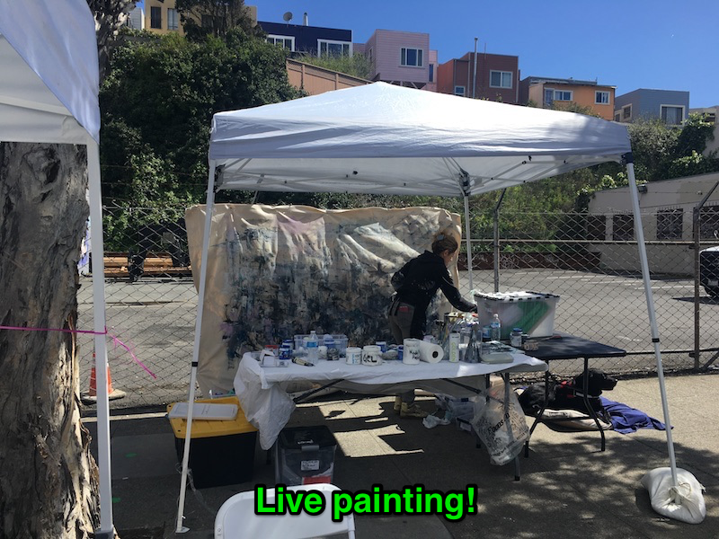

A resident I met that day described it as hell's armpit. Though perhaps she meant it in a good way. I was in one of the last working class neighborhoods left in San Francisco, at an event called Sunday Streets, which monthly hops from neighborhood to neighborhood transforming one of its main streets in to a street fair, inviting local organizations to create a physical presence to engage with the community. I was volunteering with an organization called ArtSpan. We wanted to get the message out that we're renovating the neighborhood's old defunct hospital building to be our new home which will offer community programs and studio space for artists and other efforts to keep art alive in San Francisco, thanks to a low interest lease from the city.

To watercolor paint in spray bottles, various wooden shapes for doing [resist](https://en.wikipedia.org/wiki/Resist), pens, brushes, little blank white canvases with convenient built-in keyhole fittings for hanging up we dedicated one of our tables so we could invite passers by, especially children, to create a masterpiece they can take home. And create they did. I was blown away by the worthy art they created. Young and old, black, white, Latino, Asian, etc they came, they saw, they painted.

I stood in front of the tent, trying various tactics to get people's attention and convince them to give it a try. I drew an advertisement on the asphalt with some of the colored chalk floating around. I held up finished pieces and waved them at the crowds. I thought I could sense something, fear or uncertainty, with some people. They seemed to want to participate but something held them back. It was easier to melt this inhibition with the kids, showing them how much fun people were having. With the adults, the defenses seemed much thicker.

The team consisted entirely of volunteers like myself. [Amy, a real professional artist](http://www.amyahlstrom.com/) was the mastermind and ringleader of our operation. She recounted how she had this idea, knew it would cost a lot, but ArtSpan anted up to make it possible. Her good vibes and enthusiasm, she was a school teacher for many years, really helped keep people engaged and having fun once I snagged their attention. There was also live painting by [Nicole Vismara](https://www.nicolevismara.com/) to help get people's attention.

As the show was drawing to a close, the MC on the live music stage thanked the audience for keeping the Excelsior real. This is what "real" means, I thought as I walked back to where I parked my bike. In the slanted golden afternoon sunbeams I saw life being lived on the sidewalks. Folks just chatting, getting their hair cut, kids playing, a few broken windows, and a conspicuous absence of new housing developments, shiny new coffee shops, Disneyland for well-healed millennials, etcetera, etcetera. I felt a raw striving energy, a bittersweet happiness. Something about it stole a piece of my heart. The name Excelsior can mean "excellent", as well as "ever upward". It's already lived up to the first sense, in my opinion. I hope the name is prophetic in the second sense only if it doesn't entail the creative destruction that has effected so many other parts of this city. What is too often destroyed is what gives the city that ineffable quality referred to as "soul". I know this is an old story, that San Francisco isn't what it used to be. I've heard it over and over again since moving here and often worried that I was part of the problem. The experience of volunteering and the prospective creation of the Onondaga Art Center in the old hospital building has given me more hope than anything else that the best parts of the old San Francisco are still alive, like hot coals hiding under the ashes of a mostly extinguished fire. A fire which can be rekindled.

These past few weeks I've watched my monetary wealth steadily decline due to my determination to do only what I really care about, regardless of the compensation, for as long as I can manage to do so. As I rode home in the late afternoon sunlight through the hills of the outskirts of town I felt wealthy with renewed faith, passion and purpose.

