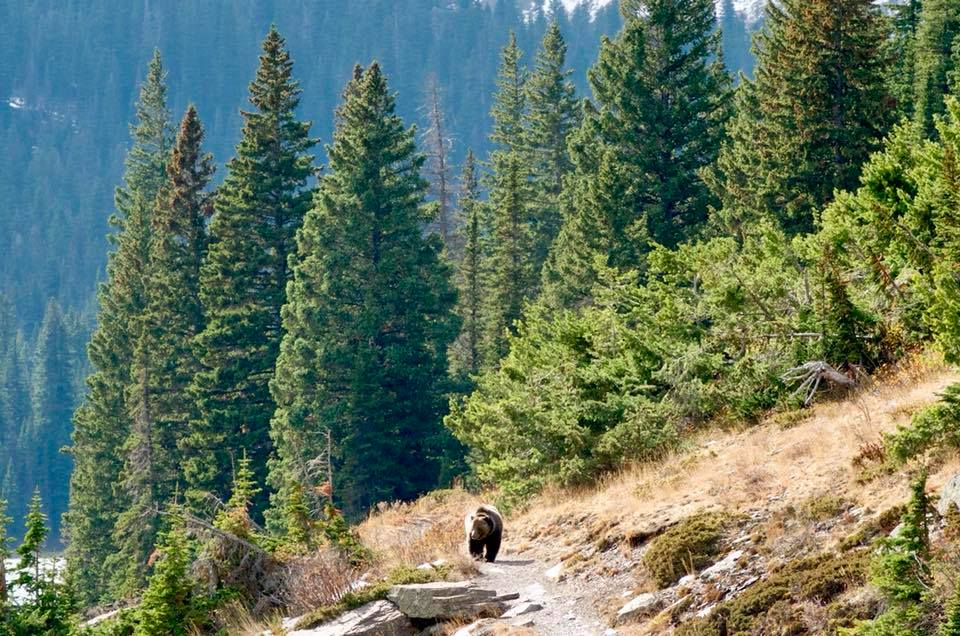

Was in Glacier National Park in Montana earlier this month. We saw some mountain goats, some birds, and this guy:

 _Grizzly bear! 📷 by [Shing](https://www.facebook.com/shingwongphotography/)_

Some other hikers coming the other direction warned us and we backtracked to the top of a hill then stopped to see if the bear was still following us. Turns out he was! I wasn't sure how fast they can run and didn't intend to find out, but of course the photographers had to snap some pics before fleeing more.

We _bearly_ got to see any of the trail!
