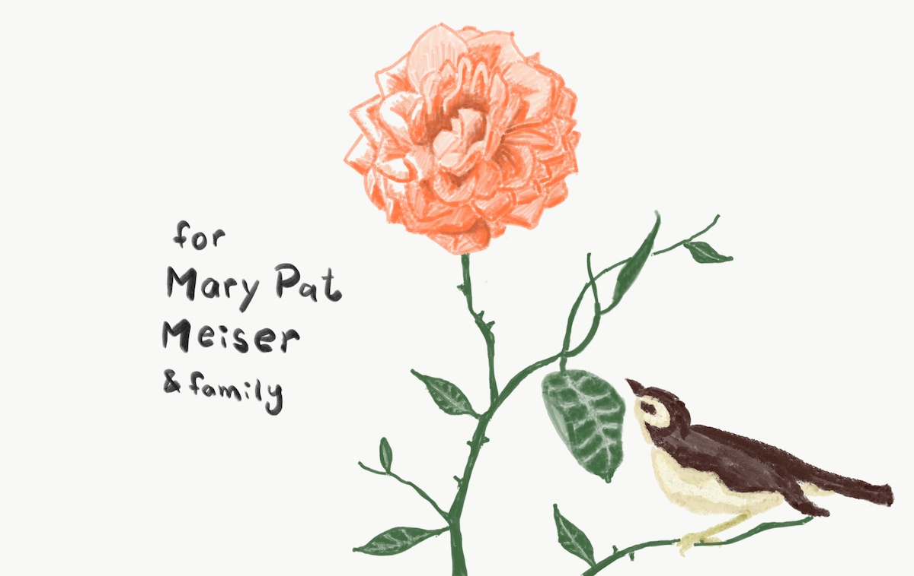

I finally feel like I’m winning the war against my insomnia. I’d been fighting this war for over two years and every night felt like a new battle. Daily exercise helped a lot, but it seemed like I needed eight hours of exercise to buy eight solid hours of sleep. For a while I thought coffee was the enemy, but I love coffee and cutting it out didn’t consistently help. I made sure my room was dark and quiet but I’d still wake up in the middle of the night in fight-or-flight response. In retrospect, it seems obvious that meditation would be a promising solution-space. I realized that the problem was all in my mind. It was a habit of thought, which doesn’t make it any less of a real problem. I had such high expectations for myself every day that being delayed or inconvenienced for just a few seconds from the pursuit of my objectives felt like an impending personal doom. I strained my mind to figure out how to squeeze every ounce of productivity out of each day. This idea of hyper-productivity sort of took on a life of its own as an overbearing task-master, who would flip on the internal fluorescent lights and sound the alarm when I needed to be sleeping.

Being randomly invited on a meditation retreat in the Santa Cruz mountains was what clued me in. As I hinted at earlier, ideas are sort of alive. They’re also contagious. I had tried meditation before, but it never really stuck. It just felt like I was wasting time. In Santa Cruz, though, I was surrounded by people who "got" it and was immersed in their ideas about meditation and saw first hand that it’s not just a thing you do for a bit in the morning in the privacy of your bedroom, but a way of life. And I saw that it could be a lot of fun. And then I “got” it. I no longer saw meditation as something I *should* do, but something I *get* to do. I don’t really understand how, but I feel like it’s more effective now. Now, after meditating, I feel like everything is quieter, slower, simpler, and more enjoyable. Since then I’ve done more research on my own and found that a blend of mindfulness meditation and compassion meditation for about 15 minutes to be hugely effective for me.

Life rarely lets you change one variable at a time, though. Soon after the meditation retreat the startup I’m a part of started seeing some payoffs for our months of hard work, and I had enjoyed increased peace of mind concerning paying my bills. Without this peace of mind I may not have applied what I learned from the retreat as much as I have. Now that I have, though, I feel like I have the tools to prevent insomnia from become a big issue again. It didn’t start with the startup, and there will always be struggle and stress in life.

I recently splurged on an iPad Pro because of the ease with which it lets me make art. I’ve found that it’s also arguably a kind of meditation. After using it I find that I’m more perceptive. I spend a lot of time writing computer code these days, which leaves me thinking and feeling more computer-like: differences below a certain threshold do not make a difference to me. But in the practice of making art, though, every detail in the subject is potentially important, and you have to train your mind to actually see those details. After drawing for a while I’m seeing the world as an artist, noticing things in my every day environment that I hadn’t noted before and seeing beauty everywhere. It doesn’t seem to matter that I’m making art with a computer. I guess the resolution is high enough and the inputs sensitive enough that to my brain it’s just like analog mediums. Also, it’s known that imagination and perception use the same circuitry in the brain, and learning to see as an artist again has helped me steal back control of that circuitry from an over-active imagination.

This one is dedicated to my Uncle’s mother, who I’ve had the pleasure of meeting at two weddings in the past couple of years, and her family. Know that y’all have been in my thoughts and prayers lately.

