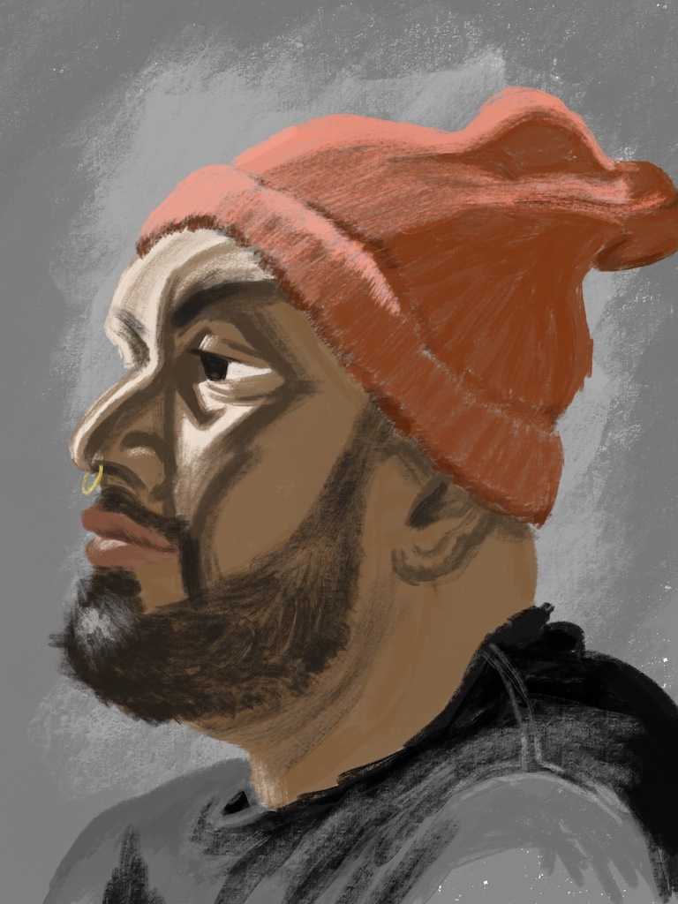

Okay, it's been a while. I've still been making art, just haven't been updating the blog. I've been saying "yes" a lot lately, maybe too much.

Here's my latest portrait from last night's class.

I was sitting almost exactly opposite of the light source, so that was fun. Still getting better at being less representational and intentionally leaving artifacts which signify that this is a human's attempt to represent something.

And if you have a minute and a half to waste, you can watch [this video](https://vimeo.com/user87775051/review/282012329/c1e07dc4ad) of the creation process.

I made another yet-to-be-posted portrait last week, but I'll wait until tomorrow to post that.

Tangentially related, but the space where the class is held is called Syzygy. The mastermind behind Syzygy was at the class last night talking about how his mission is to foster the local arts scene. He wants everyone to know that the scene in San Francisco is not dead! He plans to use the space to help emerging artists practice and gain exposure.
