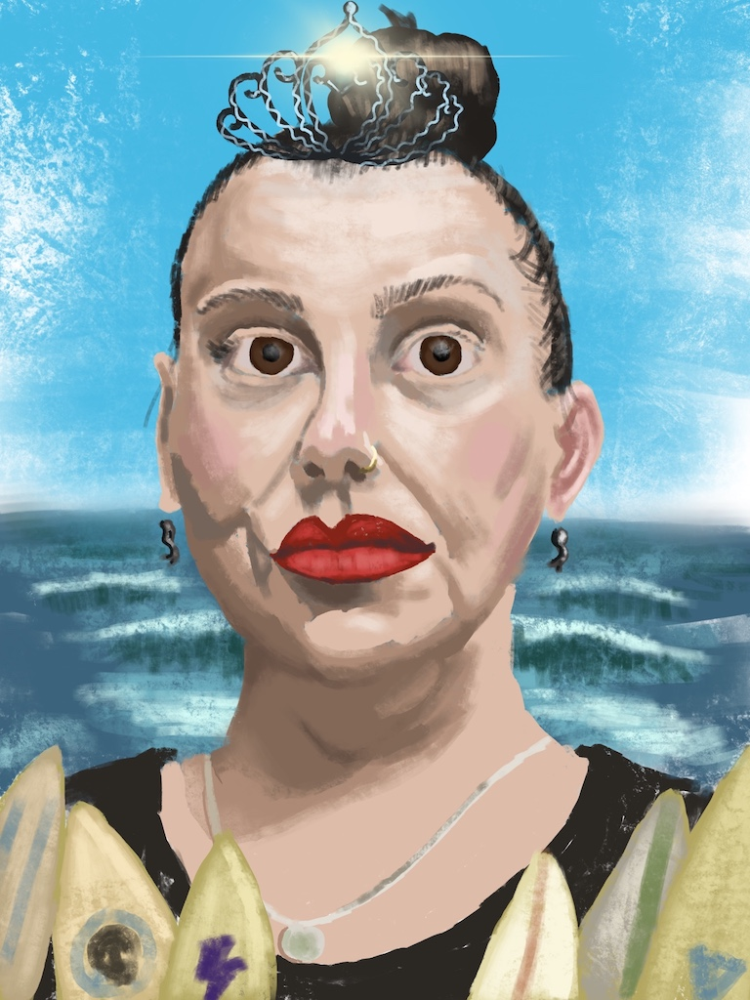

This one is actually from a couple weeks ago. The model was wearing mermaid earrings and a necklace referencing St Christopher, the patron saint of surfers, she said. She said she was going for a regal expression, so I added the tiara.

Amazing how much making art with surf imagery awakened my own memories of when I used to surf in the warmer, gentler waves of Florida.

