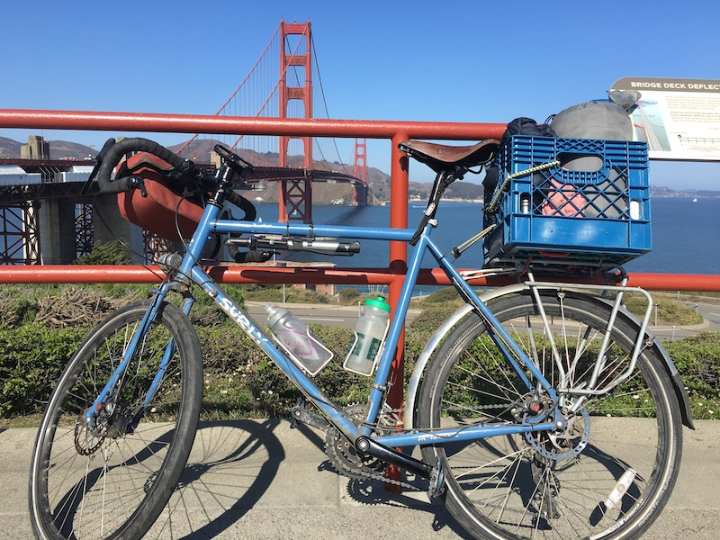
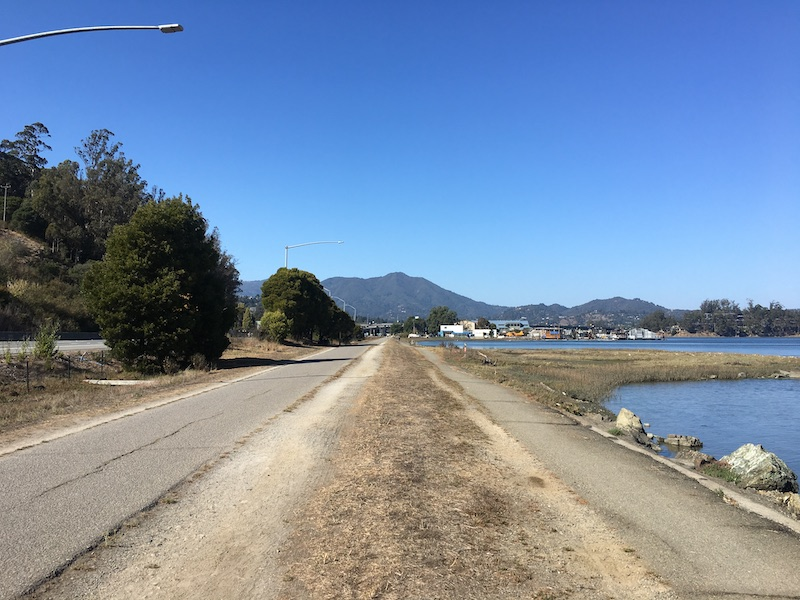
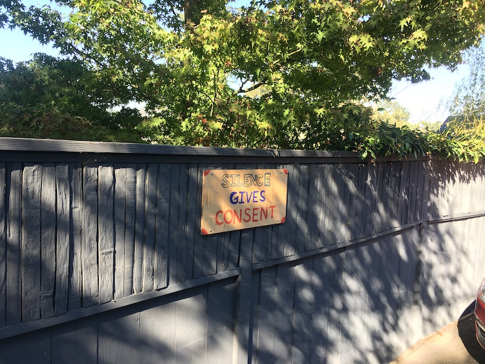
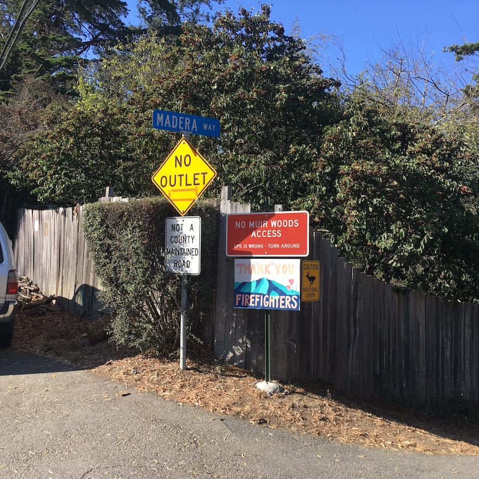
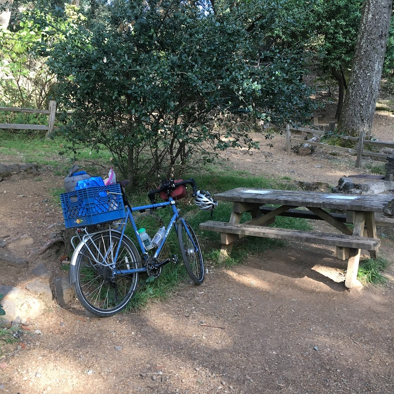
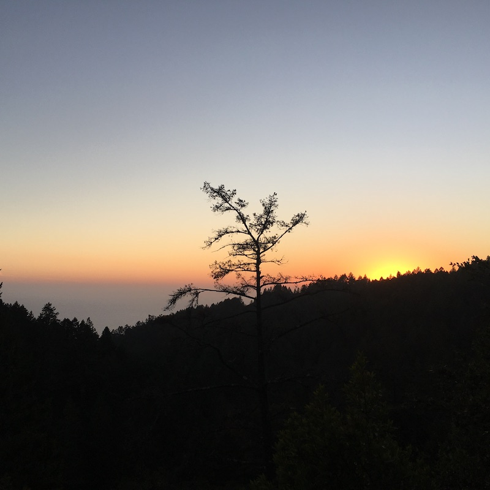
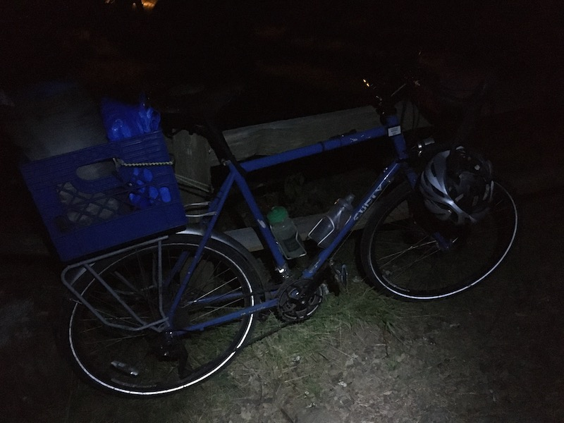
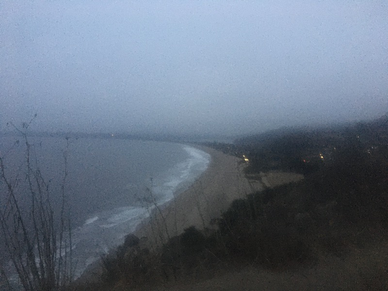
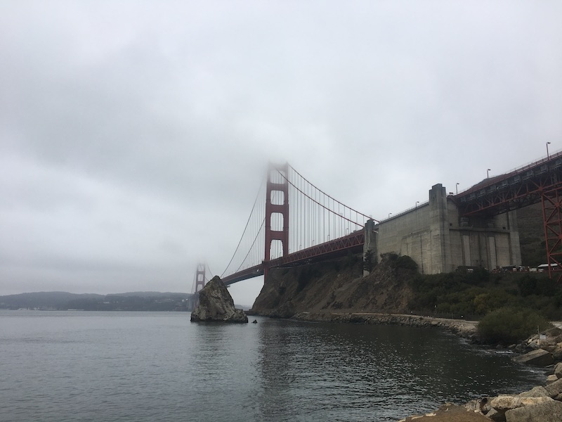
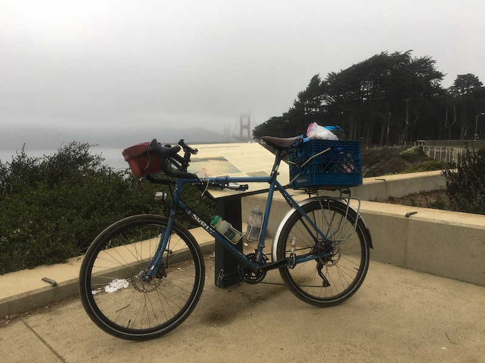

Gunmetal grey fighter jets in formation traverse the blue sky above the Golden Gate Bridge, grey lovebirds dance a chaotic areal dance in the Marin air, below them rides a lone human on a bicycle. I’ve had to get used to riding solo a lot lately. In a past life, I recall formidable anxiety about such lonesome quests. I felt a lack of something, but that was because I was looking for something within myself.

Mt Tam is before me, a great green monster. My adversary. But also my friend who’s only an adversary in the game we’re engaged in presently. What counts in this game is not achieving whatever goals I have in mind, but venturing out with pretenses of _Arete_. I’m here for whatever adventure he has in store for me. If the park ranger at Pantoll campground tells me there’s no room for me, or my bike or body fail on the way, I’ll welcome the challenge. I ride past signs thanking firefighters and first responders. The real heroes, without which I might not be able to have this adventure. I felt a buoyant sense of oneness as the forest gave way to sweeping views of Marin, the Bay and the City, ready for a plot twist as I draw near to Pantoll Campground. The sign in front reads we’re full, no more space.

The marine layer billows over the ridge on which the campground is situated, creating a grey twilight. The wind finally blows away the last of it, revealing that the sky is still blue. The park ranger strolls by and tells me that there’s still plenty of space in the space reserved for “Hike and Bike” campers. For dinner I have a large pepper and 8oz of “Real California Cheese.” For a moment I wish I have some wine to rinse it down, but then I look around and realize how much I do have. After dinner, I manage to keep myself well entertained, sittin at my picnic table, staring at the trees, listenin to the crow songs, makin up poems in my head. 

I go on a little hike and hear someone yell “sunset!” Some cars are sitting at the fork in the road, trying to go up the road to the summit which is closed due to fire danger. Red flag warning, reads the sign. That yell gives me an idea. I spy a trail that runs parallel to the summit road. Just a few minutes labor up that trail brings me in view of that coveted sunset of blue, orange and every color in between. 

I come to before sunrise. Partly because I’ve bruised every side of my body laying on the picnic table with only my sleeping bag as cushion, and partly due to excitement for the day ahead. With the silent stars watching above I roll off the table, roll up my sleeping bag and roll out of Pantoll Campground. I’m a little wistful looking at the entrance to the camp, and the dark road ahead. The road winds down, down, down. Midway I enter the marine layer again and the stars begin to fade. Spectral coyotes materialize in my headlights. One of them seems to lunge at me as I passed, but I could be imagining it. 

A kiosk cafe is miraculously open when I arrive at Stinson beach, as if just for me. It was 6:30am. Nectar of the gods — also known as coffee — never tastes better than after a cold ride down a mountain. I ride up and down along the coastal road towards Mill Valley. As the day breaks, the marine layer creates a diffuse grey light and obscures the peaks of the hills to my left.

I return to the city just in time to take part in a socially-distanced-with-masks demonstration of how everyone can access Golden Gate Park without needing to re-open more of it’s roads to cars. A colorful crew of cyclists and roller skaters gather in front of the de Young art museum. After we’re all gathered we ride around and wave, ring bells and pump out the jams. I like to think that I brought something back with me that somehow helped the cause.
