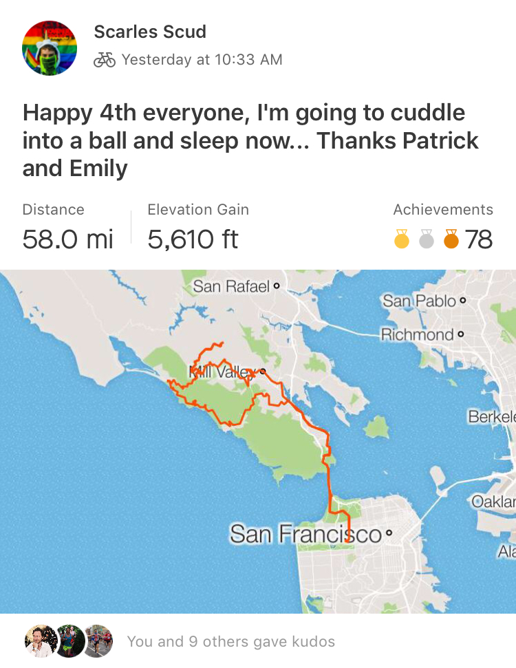
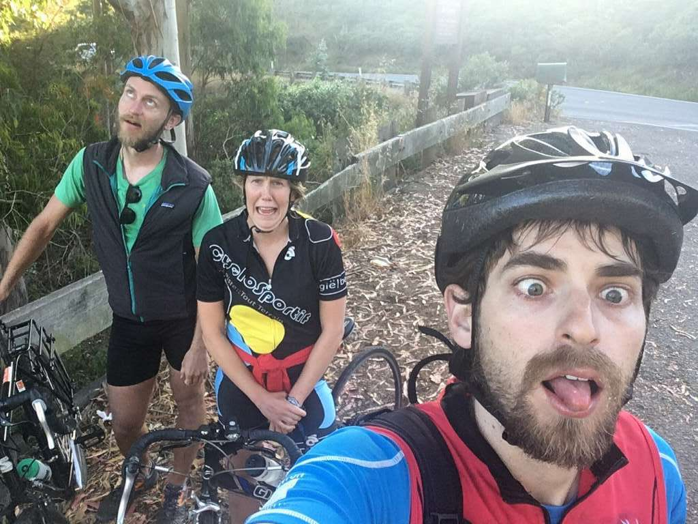

Yesterday a couple friends and I went on a bike ride that took us across the Golden Gate Bridge, to the top of [a mountain](https://en.wikipedia.org/wiki/Mount_Tamalpais) where it was unpleasantly cold and windy, then down to a beach where we passed out in the sun for a couple hours before hopping back on the bike to ride along the coast back to the city. The day before that I was visiting a [a "doocratic" (i.e. anarchic) hacker space](https://www.noisebridge.net/wiki/Noisebridge) where I learned about how such a place functions as well as video game development. It's such contrasting experiences like these, in such a short time frame, that make me feel that the 62% higher rent and everything else I put up with to live here is somewhat justified. This post is super short and more incomplete than usual because the juices just don't seem to be flowing today. Perhaps I'll expand on it another day. For now, here's some pictures from the ride:

Our route according to Strava

Are we there yet??

