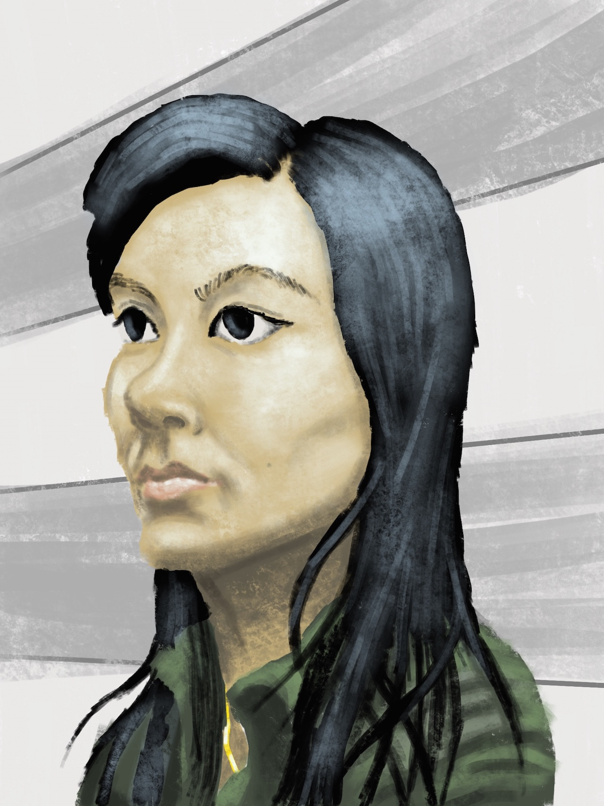

Last night I went to portrait drawing class, that is, people sitting around in a room making representations of a model sitting in a director's chair somewhere in the middle, with some music playing for inspiration. It meets every week at [a new community space](https://www.meetup.com/Syzygy-Academy/) focused on fostering the local arts scene by tailoring its services to the aspiring artist more than the established artist. This week I made perhaps my best portrait yet of the dozen or so times I've attended. I think what small amount of the painting class at CCSF I did attend helped in that I knew how to break the problem down in to smaller parts. I started by making a drawing of the model, then laid down flat regions of color, then applied tint and shading. I had a better idea of what qualities make a painting good, such a varying techniques of applying paint. One thing I noticed the other more experienced painters doing that would have made this painting better is capturing the slight variations in the hue of regions that at first blush seem like the same color, for example, the slight reddening of the face around the center of the cheeks and the tip of the nose. Also I'm still striving to get that "painterly" look where the fact that it's a painting is obvious due to the chunky brush strokes, but when you step back the represented object emerges.

My painting, made on my iPad Pro with a program called Procreate.

I always tell myself that I'm making progress when I show up and practice, and that thought in itself is a great psychological refuge when it seems like nothing else is going in the right direction. It's especially nice when I can see evidence that this thought is true, and last night, after the class, I decided to take the cable car over the hill instead of walking to celebrate.
