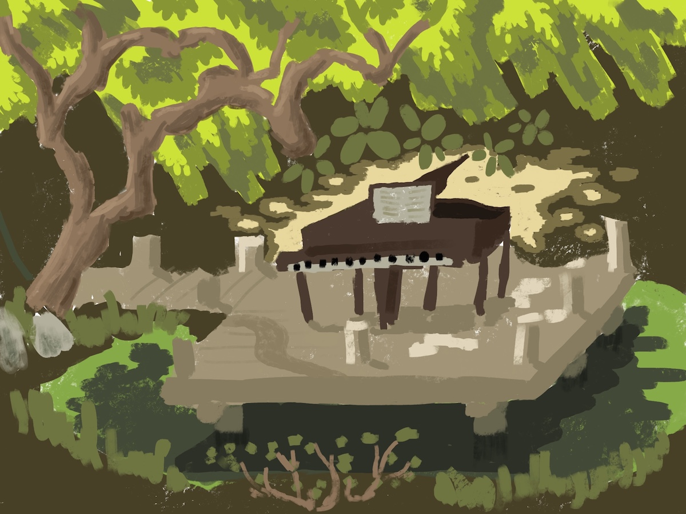

In the botanical garden, pianos are distributed throughout as if sprouted from seeds, inviting any wandering maestros to give a performance. I meander until I find a pond under a canopy of trees. In the middle of the pond, a piano hides on a tiny boardwalk. I tramp along the pond's edge,  happening upon a comfortable rock with a nice view. Some other artists are already camped out a few feet away. As I pull out my iPad, a familiar melody issues from the piano. It takes a minute for me to recognize that it's Nirvana's Smells Like Teen Spirit. It never occurred to me that grunge could sound so good on a classical instrument. The hidden pianos will be there at San Francisco botanical garden until July 16th and it's free for city residents!

