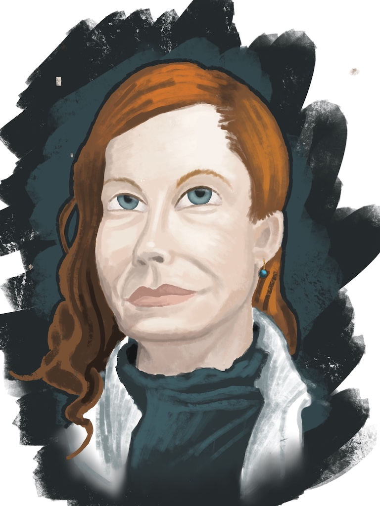
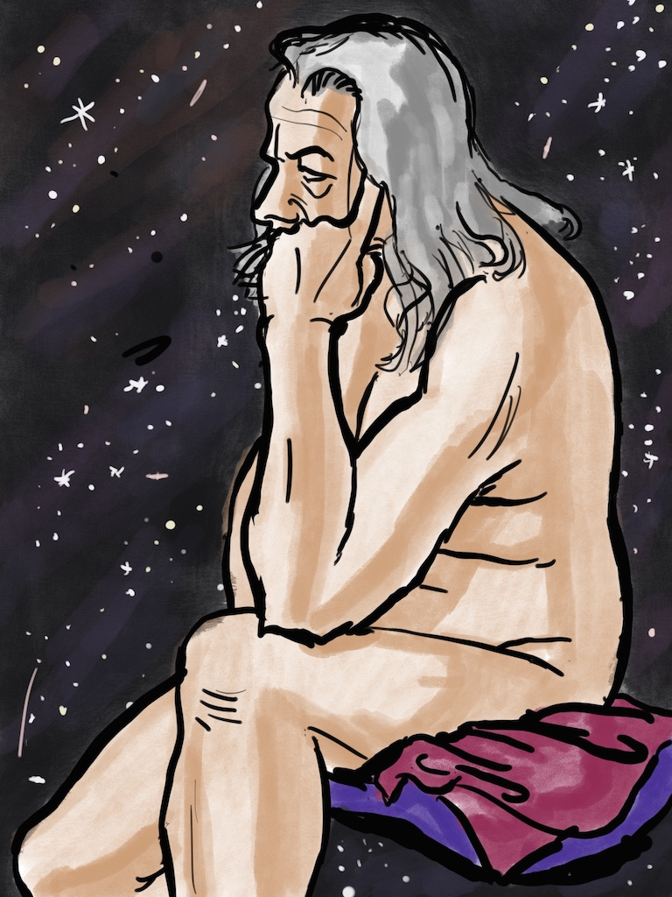

Portrait of a model named KT

A figure drawing that ended up looking very Judeo-Christian deity-like.

I'm getting better at being less representational in my art. It's like swimming in the ocean and gradually getting comfortable with being farther and farther from shore. Eventually I'll let go completely.

The first is from the weekly portrait class. I'm happy about the more visible brush strokes that still manage to suggest form.

The second is from a figure drawing class. It reminded me of the Calvin and Hobbes strips where Calvin imagines himself as the vengeful god of his imaginary universe, so I tried to emulate Waterson's style in those strips.
